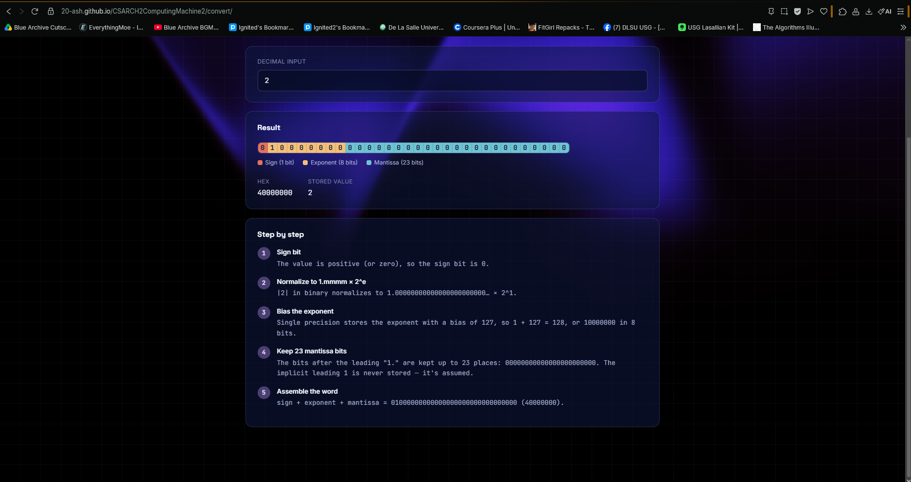
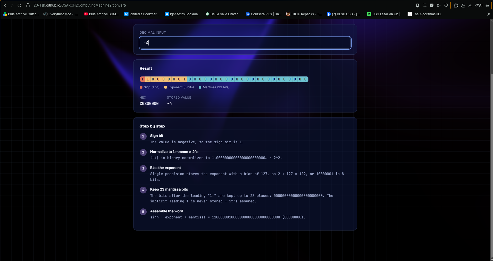
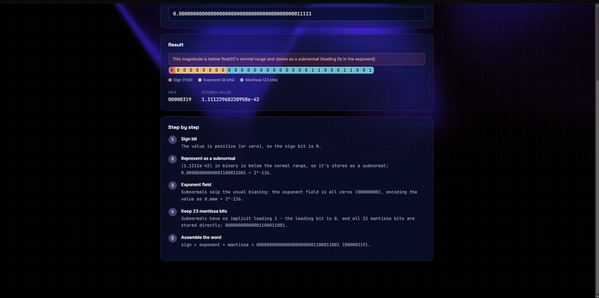
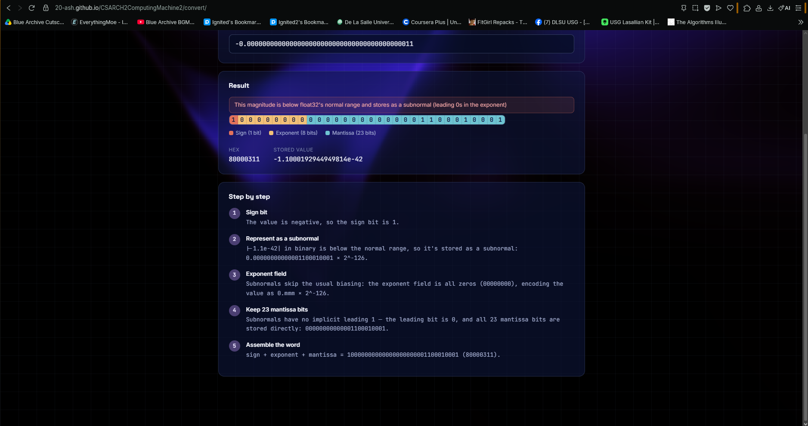
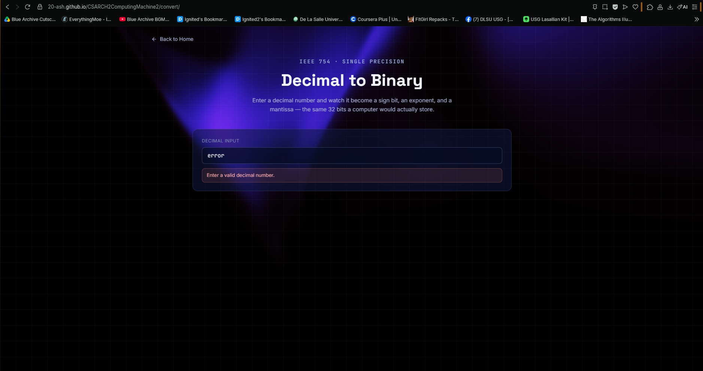
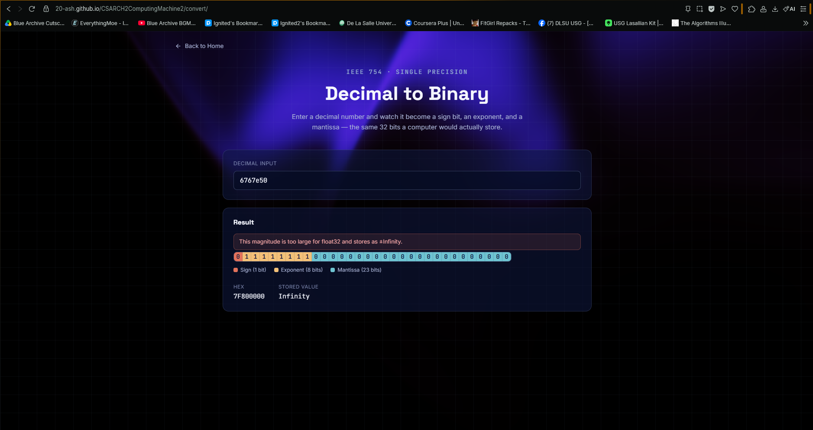
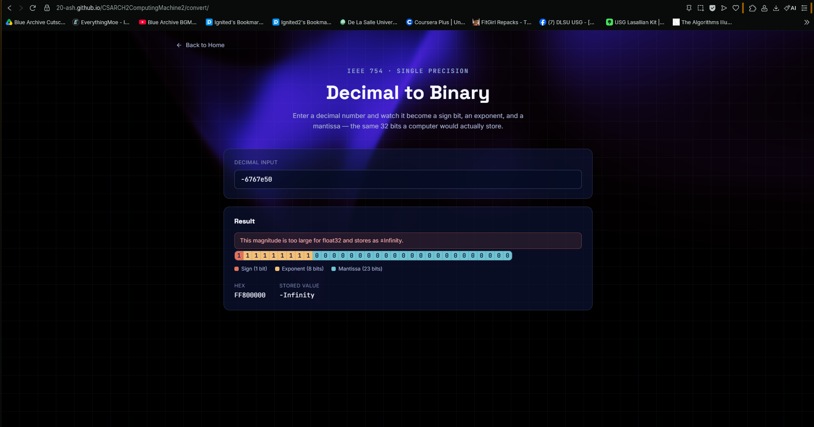

# CSARCH2 Computing Machine 2 - IEEE 754 Binary Single-precision

## 1. Project Overview

### A web-based simulator that implements IEEE 754 binary single-precision floating-point conversion that does the following:

* Accepts a decimal input and converts it into its 32-bit IEEE 754 binary and hexadecimal representation.  rounding methods (truncation and round-up) and IEEE 754 arithmetic (addition and multiplication).
* Accept a decimal or a binary input along with the target number of bits for rounding. App outputs the various rounding operations via truncation, round-up, round-down, and round-to-nearest ties-to-even.
* Accept two operands, either both decimal or  both IEEE hexadecimal then another input indicating the operation. App outputs the step-by-step solution in binary, hexadecimal, and decimal representations.

### Implementation found in `backend.ts`

## 2. Analysis Write-Up

### 2.1. Conversion Methods

| Stage | Function | Responsibility |
|---|---|---|
| Sign | `determineSign` | Returns 1 if negative or `-0`, else 0 |
| Integer part | `convertWhole` | Repeatedly divides by 2, collecting remainders (LSB first), then reverses |
| Fraction part | `convertFrac` | Repeatedly multiplies by 2, extracting the integer bit (with extra guard/round/sticky bits) |
| Normalize | `normalize` | Shifts the binary point so one significant digit precedes it; computes unbiased exponent and mantissa |
| Round | `roundMantissa` | Round-to-nearest, ties-to-even; propagates carry and signals overflow |
| Exponent encode | `determineExponentBits` | Adds bias 127; handles subnormal (all 0s) and infinity (all 1s) |
| Assemble | `buildBinary` / `buildHex` | Concatenates 1+8+23 bits, formats in nibbles, converts to hex |

### 2.2. Rounding Methods

The backend implements four rounding modes for binary, decimal, and IEEE-754 single precision inputs:
- **Truncation** (`truncateBinary` / `truncateDec`): drops all bits/digits beyond the target precision, toward zero.
- **Round up** (`roundUpBinary` / `roundUpDec`): rounds toward positive infinity; negative values follow truncation rules for rounding toward positive infinity.
- **Round up** (`roundDownBinary` / `roundDownDec`): rounds toward negative infinity; positive values follow truncation rules for rounding toward negative infinity.
- **Round to nearest, ties to even** (`roundNearBinary` / `roundNearDec`): rounds to the nearest integer; if it lies exactly at the midpoint, either truncate if already even or round up to nearest even if odd

#### Helper Functions & Data Structures

| Stage / Data Structure | Name | Responsibility / Specification |
|---|---|---|
| Input Format & Dispatch | `roundingMethods` | Entry point; routes Binary, Decimal, or IEEE-754 single precision inputs to their respective rounding handlers |
| Binary Input Schema | `FormattedBinaryInput` | Custom type storing sign metadata (`signed`, `signBit`), magnitude bit array, and fractional point index |
| Result Output Schemas | `ArithmeticBinaryResult` / `DecimalResult` | Custom types returning rounded magnitude/value, `guardBit`, `stickyAny`, and `roundedUp` flag |
| Binary Input Parsing | `formatBinaryInput` | Cleans raw binary string, extracts sign bit, identifies decimal point index, and parses magnitude array |
| IEEE-754 Input Parsing | `parseIeeeInputToDecimal` | Decodes 32-bit binary strings or 8-digit hexadecimal patterns into standard float32 numbers via `DataView` |
| First Significant Fig | `findFirstSigFig` | Locates the index of the first non-zero bit/digit in the magnitude array |
| Binary Guard & Sticky | `getBinaryGuardAndSticky` | Determines the Guard Bit (bit immediately following target bits) and Sticky Bit status (whether any bit beyond Guard Bit is 1) |
| Binary Incrementer | `incrementBinaryAtCut` | Performs binary addition (+1 at LSB/cut index), handles carry bit propagation across MSB, and adjusts decimal point |
| Decimal Guard & Sticky | `getDecimalGuardSticky` | Determines Guard Digit and Sticky Status for decimal/scientific notation strings |
| Decimal Incrementer | `incrementDecimalString` | Increments kept magnitude using `BigInt` arithmetic and reinserts the decimal point |

#### Mode Implementations

| Rounding Mode | Binary Function | Decimal Function | Behavior & Rules |
|---|---|---|---|
| **Truncation (RTZ)** | `truncateBinary` | `truncateDec` | **Round toward zero:** Drops all bits/digits beyond the target precision. Never increments magnitude regardless of discarded bits. |
| **Round Up (RTP)** | `roundUpBinary` | `roundUpDec` | **Round toward $+\infty$:** If positive and non-zero bits/digits are discarded, increments magnitude by +1 at cut position. Negative numbers default to truncation. |
| **Round Down (RTN)** | `roundDownBinary` | `roundDownDec` | **Round toward $-\infty$:** If negative and non-zero bits/digits are discarded, increments magnitude away from zero. Positive numbers default to truncation. |
| **Round to Nearest (RNE)** | `roundNearBinary` | `roundNearDec` | **Round-to-Nearest, Ties-to-Even:**  • If Guard Bit $> \text{midpoint}$ (1 for binary, $>5$ for decimal): Increments magnitude. • If Guard Bit equals midpoint with Sticky $= 1$: Increments magnitude. • If exact tie (Sticky $= 0$): Increments only if the last kept digit (LSB) is odd, rounding to the nearest even number. |

### 2.3. Arithmetic Methods

The backend implements IEEE 754 single‑precision addition and multiplication via `ieeeAdd` and `ieeeMul`. Both functions handle special cases, operand preparation, computation, normalization, rounding, and final encoding — consistently returning valid 8‑digit uppercase hexadecimal values alongside binary and decimal outputs.

**Special Case Handling**
| Case | Binary Representation | Hex Value |
|---|---|---|
| Positive Zero | `0 00000000 00000000000000000000000` | `00000000` |
| Negative Zero | `1 00000000 00000000000000000000000` | `80000000` |
| Positive Infinity | `0 11111111 00000000000000000000000` | `7F800000` |
| Negative Infinity | `1 11111111 00000000000000000000000` | `FF800000` |
| NaN (Not a Number) | — | `7FC00000` |

**Addition Pipeline**
`ieeeAdd` → Convert operands → Unpack sign, exponent, mantissa → Align exponents by right‑shifting the smaller mantissa → Add or subtract mantissas based on sign → Normalize result → Apply rounding → Re‑encode exponent and mantissa → Assemble final binary and hexadecimal output.

**Multiplication Pipeline**
`ieeeMul` → Convert operands → Unpack sign, exponent, mantissa → Compute result sign via XOR → Sum de‑biased exponents and adjust bias → Multiply mantissas → Normalize result → Apply rounding → Re‑encode exponent and mantissa → Assemble final binary and hexadecimal output.

## 3. Screenshots

- **Convert Normal**

  

- **Convert Negative Normal**

  

- **Convert Denormalized**

  

- **Convert Negative Denormalized**

  

- **Convert Error Checking**

  

- **Convert Positive Infinity Edge Case**

  

- **Convert Negative Infinity Edge Case**

  

## 4. Video Walkthrough

WE APPEND OUR VIDEO.
